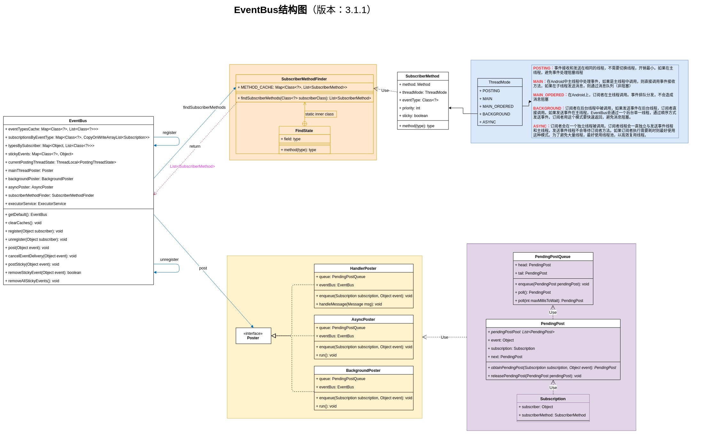
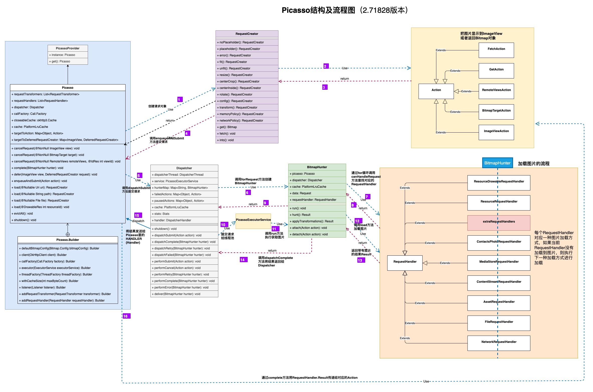
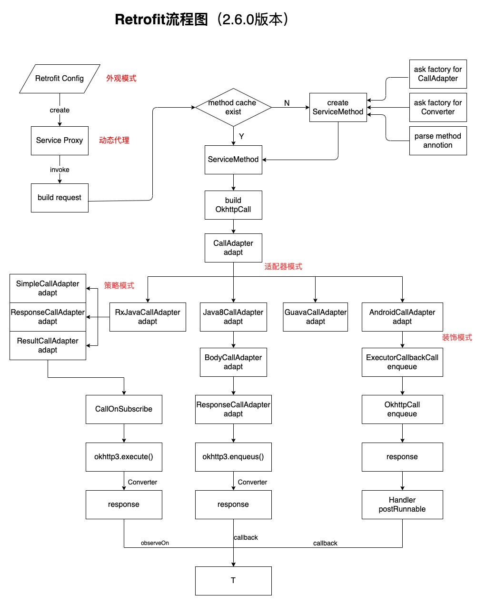
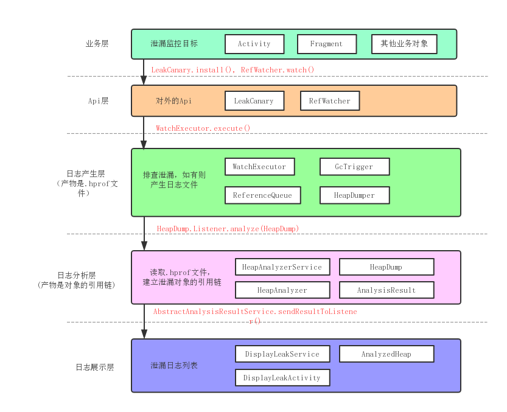

<h1 align="center">AndroidCommonLibrary</h1>

  

> Android常用依赖库分析，包含：EventBus、Picasso、Glide、Gson、okhttp、RxAndroid、RxJava、etc...

## 1.项目信息表格

| 项目                     | Github地址                                                   |     版本     | 开发工具 | 是否完成 |
| ------------------------ | ------------------------------------------------------------ | :----------: | :------: | :------: |
| EventBus                 | https://github.com/greenrobot/EventBus                       |    3.1.1     |    AS    | 完成 |
| Picasso                  | https://github.com/square/picasso                            |   2.71828    |    AS    |     完成     |
| Glide                    | https://github.com/bumptech/glide                            |    4.11.0     |    AS    |          |
| Gson                     | https://github.com/google/gson                               |    2.8.5     |    AS    |          |
| okio                     | https://github.com/square/okio                               |  1.x(Java)   |   Idea   |          |
| okhttp                   | https://github.com/square/okhttp                             | 3.14.x(Java) |   Idea   |          |
| Retrofit                 | https://github.com/square/retrofit                           |    2.6.0     |   Idea   | 完成     |
| RxAndroid                | https://github.com/ReactiveX/RxAndroid                       |    2.1.1     |    AS    |          |
| RxJava                   | https://github.com/ReactiveX/RxJava                          |     3.x      |   Idea   |          |
| Dagger2                  | https://github.com/google/dagger                             |     2.x      |   Idea   |          |
| leakcanary               | https://github.com/square/leakcanary                         |    1.6.3     |    AS    | 完成 |
| guava                    | https://github.com/google/guava                              |    28-jre    |   Idea   |          |
| VirtualXposed            | https://github.com/android-hacker/VirtualXposed              |    master    |    AS    |          |
| dexposed                 | https://github.com/alibaba/dexposed                          |    master    |    AS    |          |
| AndroidUtilCode          | https://github.com/Blankj/AndroidUtilCode                    |   abc7a5da   |    AS    |          |
|                          |                                                              |              |          |          |

##  2.版本

| 库         | 版本-语言                      | 备注 |
| ---------- | ------------------------------ | ---- |
| okio       | 1.x(Java) 2.x(kotlin)      |      |
| okhttp     | 3.14.x(Java) 4.0.x(kotlin) |      |
| leakcanary | 1.6.3(Java) 2.x(kotlin)    |      |
|            |                                |      |

## 3.项目涉及知识

* [自定义注解](/AndroidAnnotation/README.md)

## 4.参考文章

* [「Leakcanary 源码分析」看这一篇就够了](https://www.jianshu.com/p/9cc0db9f7c52)
* [LeakCanary 源码分析](https://www.jianshu.com/p/18b04ff44c5f)
* [LeakCanary 原理解析](https://my.oschina.net/u/3146965/blog/1797236)

##  5.结构流程图

EventBus

Picasso

Retrofit

leakcanary

